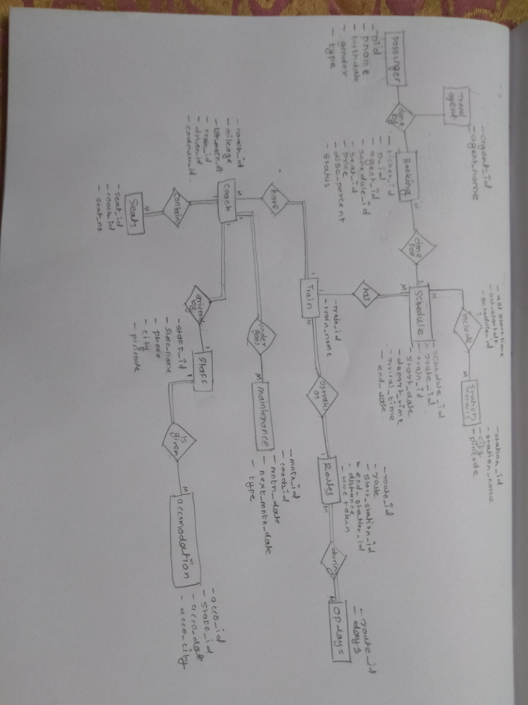
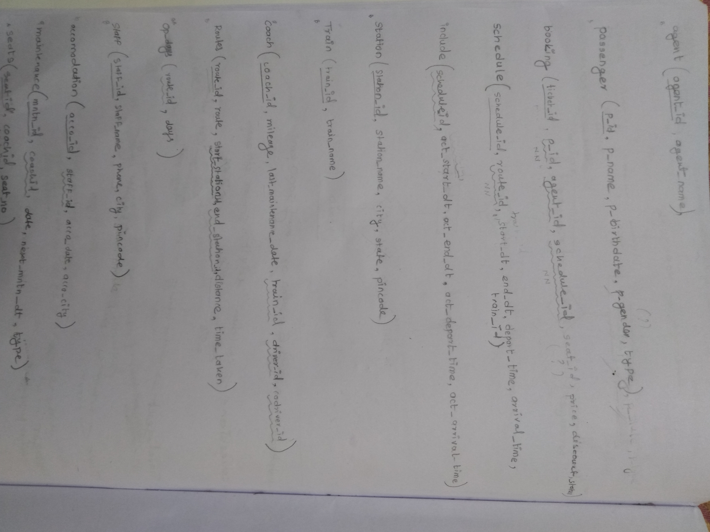

# CA105-Assignment-1-Group-9

Memebers:
ABHISHEK PATEKAR (23112025)
SIDDHARTH GAIKWAD (23112009)
VED GURUNULE (23112041)

Group 9 has created a database name IET in response to Assignment 1's Part 1 and Part 2.
We understood that we'll need to have Passenger, Travel Agent, Bookings, Schedule, Station Details, Train, Routes, Coach, Seats, Staff, Maintenance, and Accomodation tables at least in our database.
All the work was equally distributed.

ER diagram

Relations

From Part 2
SET A is solved by 23112009
SET B is solved by 23112041
SET C is solved by 23112025

These are the queries we used to create our database.
create database IET; #creates IET Database
use IET; #uses IET database now all queries will be for this database

create table agent(
agent_id varchar(10),
agent_name varchar(50));

create table passenger(
p_id varchar(10),
p_name varchar(50),
p_birhtdate date,
p_gender varchar(20),
p_type varchar(20));

create table booking(
ticket_id varchar(10),
p_id varchar(10),
agent_id varchar(10),
schedule_id varchar(10),
seat_id varchar(10),
price int,
disc_percent int);

create table schedule(
schedule_id varchar(10),
route_id varchar(10),
start_date date,
end_date date,
depart_time time,
arrival_time time);

create table include(
schedule_id varchar(10),
act_start_date date,
act_end_date date,
act_depart_time time,
act_arrival_time time);

create table station(
station_id varchar(10),
station_name varchar(50),
city varchar(50),
pincode int);

create table train(
train_id varchar(10),
train_name varchar(50));

create table coach(
coach_id varchar(10),
mileage int,
last_mntn_dt date,
train_id varchar(10),
driver_id varchar(10),
codriver_id varchar(10));

create table route(
route_id varchar(10),
route varchar(50),
start_station_id varchar(10),
end_station_id varchar(10),
distance int,
time_taken varchar(50));

create table op_days(
route_id varchar(10),
days varchar(10));

create table staff(
staff_id varchar(10),
staff_name varchar(50),
phone int,
city varchar(50),
pincode int);

create table accomodation(
acco_id varchar(10),
staff_id varchar(10),
acco_date date,
acco_city varchar(50));

create table maintenance(
mntn_id varchar(10),
coach_id varchar(10),
mntn_date date,
next_mntn_date date,
type varchar(50));

create table seats(
seat_id varchar(10),
coach_id varchar(10),
seat_no int);

alter table agent
add primary key(agent_id);

alter table passenger
add primary key(p_id);

alter table booking
add primary key(ticket_id);

alter table schedule
add primary key(schedule_id);

alter table station
add primary key(station_id);

alter table train
add primary key(train_id);

alter table coach
add primary key(coach_id);

alter table route
add primary key(route_id);

alter table staff
add primary key(staff_id);

alter table accomodation
add primary key(acco_id);

alter table maintenance
add primary key(mntn_id);

alter table seats
add primary key(seat_id);

alter table booking
add foreign key(p_id) references passenger(p_id);

alter table booking
add foreign key(agent_id) references agent(agent_id);

alter table booking
add foreign key(schedule_id) references schedule(schedule_id);

alter table schedule
add foreign key(route_id) references route(route_id);

alter table include
add foreign key(schedule_id) references schedule(schedule_id);

alter table include
add column station_id varchar(10) after schedule_id;

alter table include
add foreign key(station_id) references station(station_id);

alter table coach
add foreign key(driver_id) references staff(staff_id);

alter table coach
add foreign key(codriver_id) references staff(staff_id);

alter table route
add foreign key(end_station_id) references station(station_id);

alter table op_days
add foreign key(route_id) references route(route_id);

alter table maintenance
add foreign key(coach_id) references coach(coach_id);

alter table seats
add foreign key(coach_id) references coach(coach_id);

alter table booking
change column p_id p_id varchar(10) not null;

alter table booking
change column schedule_id schedule_id varchar(10) not null;

-- Inserting data into the agent table
INSERT INTO agent (agent_id, agent_name) VALUES
('A0001', 'Aarav Patel'),
('A0002', 'Sanya Desai'),
('A0003', 'Vikram Sharma'),
('A0004', 'Anaya Kapoor'),
('A0005', 'Rohan Mehra'),
('A0006', 'Isha Singh'),
('A0007', 'Arjun Kumar'),
('A0008', 'Neha Reddy'),
('A0009', 'Raj Malhotra'),
('A0010', 'Priya Verma'),
('A0011', 'Aditya Gupta'),
('A0012', 'Pooja Joshi'),
('A0013', 'Varun Bansal'),
('A0014', 'Kavya Khanna'),
('A0015', 'Aryan Kapoor'),
('A0016', 'Ishita Gupta'),
('A0017', 'Akash Sharma'),
('A0018', 'Meera Singh'),
('A0019', 'Rahul Agarwal'),
('A0020', 'Sneha Yadav');

--Inserting data into train table
-- Inserting 20 rows of data into the train table
INSERT INTO train (train_id, train_name)
VALUES
    ('T001', 'Rajdhani Express'),
    ('T002', 'Shatabdi Express'),
    ('T003', 'Duronto Express'),
    ('T004', 'Garib Rath'),
    ('T005', 'Deccan Queen'),
    ('T006', 'Konkan Kanya Express'),
    ('T007', 'Hawrah Mail'),
    ('T008', 'Mumbai Local'),
    ('T009', 'Chennai Express'),
    ('T010', 'Kolkata Express'),
    ('T011', 'Ganga Jamuna Express'),
    ('T012', 'Malabar Express'),
    ('T013', 'Jodhpur Express'),
    ('T014', 'Bengaluru Shatabdi'),
    ('T015', 'Punjab Mail'),
    ('T016', 'Goa Express'),
    ('T017', 'Ahmedabad Express'),
    ('T018', 'Kochi Rajya Rani'),
    ('T019', 'Ooty Mountain Rail'),
    ('T020', 'Delhi Metro');

INSERT INTO station (station_id, station_name, city, pincode) VALUES
('S0001', 'Mumbai Central', 'Mumbai', 400001),
('S0002', 'New Delhi Junction', 'New Delhi', 110001),
('S0003', 'Chennai Central', 'Chennai', 600001),
('S0004', 'Howrah Junction', 'Kolkata', 700001),
('S0005', 'Bangalore City', 'Bangalore', 560001),
('S0006', 'Hyderabad Deccan', 'Hyderabad', 500001),
('S0007', 'Ahmedabad Junction', 'Ahmedabad', 380001),
('S0008', 'Pune Junction', 'Pune', 411001),
('S0009', 'Jaipur Junction', 'Jaipur', 302001),
('S0010', 'Lucknow Charbagh', 'Lucknow', 226001),
('S0011', 'Kochi Junction', 'Kochi', 682001),
('S0012', 'Bhopal Junction', 'Bhopal', 462001),
('S0013', 'Patna Junction', 'Patna', 800001),
('S0014', 'Kanpur Central', 'Kanpur', 208001),
('S0015', 'Coimbatore Junction', 'Coimbatore', 641001),
('S0016', 'Nagpur Junction', 'Nagpur', 440001),
('S0017', 'Indore Junction', 'Indore', 452001),
('S0018', 'Vadodara Junction', 'Vadodara', 390001),
('S0019', 'Thiruvananthapuram Central', 'Thiruvananthapuram', 695001),
('S0020', 'Guwahati Junction', 'Guwahati', 781001);

INSERT INTO station (station_id, station_name, city, pincode) VALUES
('S0021', 'Gandhinagar Junction', 'Gandhinagar', 382001),
('S0022', 'Shimla Junction', 'Himachal', 171001),
('S0023', 'Secunderabad Junction', 'Secunderabad', 500003),
('S0024', 'Visakhapatnam Junction', 'Visakhapatnam', 530001),
('S0025', 'Sainagar Shirdi', 'Shirdi', 423109),
('S0026', 'Solapur Junction', 'Solapur', 413001),
('S0027', 'Old Delhi Junction', 'Delhi', 110006),
('S0028', 'Lonavala', 'Lonavala', 410401),
('S0029', 'Ajmer Junction', 'Ajmer', 305001),
('S0030', 'Dharwad', 'Dharwad', 580001),
('S0031', 'Goa', 'Goa', 403001);

INSERT INTO route (route_id, route, start_station_id, end_station_id, distance, time_taken) VALUES
('R0001', 'Mumbai Central to Gandhinagar', 'S0001', 'S0021', 548, '5 Hours 40 Minutes'),
('R0002', 'New Delhi to Himachal', 'S0002', 'S0022', 412, '6 Hours 10 Minutes'),
('R0003', 'Secunderabad to Visakhapatnam', 'S0023', 'S0024', 500, '8 Hours 30 Minutes'),
('R0004', 'Mumbai Central to Sainagar Shirdi', 'S0001', 'S0025', 248, '5 Hours 20 Minutes'),
('R0005', 'Mumbai Central to Solapur', 'S0001', 'S0026', 400, '6 Hours 35 Minutes'),
('R0006', 'Bhopal to Delhi', 'S0012', 'S0027', 700, '7 Hours 45 Minutes'),
('R0007', 'Lonavala to Ajmer', 'S0028', 'S0029', 1062, '10 Hours 45 Minutes'),
('R0008', 'Dharwad to Bengaluru', 'S0030', 'S0005', 432, '5 Hours'),
('R0009', 'Bhopal to Indore', 'S0012', 'S0017', 246, '3 Hours'),
('R0010', 'Mumbai Central to Goa', 'S0001', 'S0031', 588, '6 Hours');

-- Inserting 20 rows of data into the staff table
INSERT INTO staff (staff_id, staff_name, phone, city, pincode) VALUES
    ('WX0001', 'Amit Sharma', 9876543210, 'Mumbai', 400001),
    ('WX0002', 'Priya Patel', 9988776655, 'Delhi', 110001),
    ('WX0003', 'Rahul Singh', 7654321098, 'Chennai', 600001),
    ('WX0004', 'Pooja Gupta', 8765432109, 'Kolkata', 700001),
    ('WX0005', 'Ravi Verma', 9898989898, 'Bangalore', 560001),
    ('WX0006', 'Anita Das', 9090909090, 'Hyderabad', 500001),
    ('WX0007', 'Nitin Joshi', 8765432101, 'Ahmedabad', 380001),
    ('WX0008', 'Sneha Deshmukh', 9876543212, 'Pune', 411001),
    ('WX0009', 'Vijay Kumar', 9988776656, 'Jaipur', 302001),
    ('WX0010', 'Swati Singh', 7654321099, 'Lucknow', 226001),
    ('WX0011', 'Rajesh Khanna', 8765432102, 'Kochi', 682001),
    ('WX0012', 'Meena Choudhary', 9090909091, 'Bhopal', 462001),
    ('WX0013', 'Sanjay Dubey', 8765432103, 'Patna', 800001),
    ('WX0014', 'Rekha Sharma', 9898989899, 'Kanpur', 208001),
    ('WX0015', 'Arjun Menon', 9090909092, 'Coimbatore', 641001),
    ('WX0016', 'Anjali Desai', 9876543214, 'Nagpur', 440001),
    ('WX0017', 'Rahul Gupta', 9988776658, 'Indore', 452001),
    ('WX0018', 'Kiran Patel', 7654321101, 'Vadodara', 390001),
    ('WX0019', 'Vishal Nair', 8765432105, 'Thiruvananthapuram', 695001),
    ('WX0020', 'Preeti Barua', 9090909093, 'Guwahati', 781001);

INSERT INTO staff (staff_id, staff_name, phone, city, pincode)
VALUES ('WX1234', 'Ketan Vibhuti', 9812131415, 'Pune', 411007);

-- Inserting 70 rows of data into the coach table
INSERT INTO coach (coach_id, mileage, last_mntn_dt, train_id, driver_id, codriver_id) VALUES
    ('C0001', 4500, '2023-03-12', 'T001', 'WX0001', 'WX0002'),
    ('C0002', 5200, '2023-02-28', 'T001', 'WX0003', 'WX0004'),
    ('C0003', 3500, '2023-01-15', 'T001', 'WX0005', 'WX0006'),
    ('C0004', 4800, '2023-04-20', 'T001', 'WX0007', 'WX0008'),
    ('C0005', 5800, '2023-05-10', 'T001', 'WX0009', 'WX0010'),
    ('C0006', 3200, '2023-06-05', 'T001', 'WX0011', 'WX0012'),
    ('C0007', 5500, '2023-07-15', 'T001', 'WX0013', 'WX0014'),
    ('C0008', 4000, '2023-08-22', 'T001', 'WX0015', 'WX0016'),
    ('C0009', 4200, '2023-09-28', 'T001', 'WX0017', 'WX0018'),
    ('C0010', 3600, '2023-10-15', 'T001', 'WX0019', 'WX0020'),
    ('C0011', 5100, '2023-01-05', 'T002', 'WX0002', 'WX0003'),
    ('C0012', 3300, '2023-02-10', 'T002', 'WX0004', 'WX0005'),
    ('C0013', 4900, '2023-03-25', 'T002', 'WX0006', 'WX0007'),
    ('C0014', 3800, '2023-04-30', 'T002', 'WX0008', 'WX0009'),
    ('C0015', 4200, '2023-05-20', 'T002', 'WX0010', 'WX0011'),
    ('C0016', 5500, '2023-06-15', 'T002', 'WX0012', 'WX0013'),
    ('C0017', 3400, '2023-07-28', 'T002', 'WX0014', 'WX0015'),
    ('C0018', 4700, '2023-08-15', 'T002', 'WX0016', 'WX0017'),
    ('C0019', 5900, '2023-09-02', 'T002', 'WX0018', 'WX0019'),
    ('C0020', 3900, '2023-10-10', 'T002', 'WX0020', 'WX0001'),
    ('C0021', 4100, '2023-02-01', 'T003', 'WX0003', 'WX0004'),
    ('C0022', 5300, '2023-03-18', 'T003', 'WX0005', 'WX0006'),
    ('C0023', 3700, '2023-04-05', 'T003', 'WX0007', 'WX0008'),
    ('C0024', 5000, '2023-05-12', 'T003', 'WX0009', 'WX0010'),
    ('C0025', 6000, '2023-06-20', 'T003', 'WX0011', 'WX0012'),
    ('C0026', 3300, '2023-07-25', 'T003', 'WX0013', 'WX0014'),
    ('C0027', 4600, '2023-08-10', 'T003', 'WX0015', 'WX0016'),
    ('C0028', 5700, '2023-09-15', 'T003', 'WX0017', 'WX0018'),
    ('C0029', 3800, '2023-10-22', 'T003', 'WX0019', 'WX0020'),
    ('C0030', 4400, '2023-11-05', 'T003', 'WX0002', 'WX0003'),
    ('C0031', 4900, '2023-01-20', 'T004', 'WX0004', 'WX0005'),
    ('C0032', 3500, '2023-02-28', 'T004', 'WX0006', 'WX0007'),
    ('C0033', 5200, '2023-03-15', 'T004', 'WX0008', 'WX0009'),
    ('C0034', 4000, '2023-04-20', 'T004', 'WX0010', 'WX0011'),
    ('C0035', 4800, '2023-05-10', 'T004', 'WX0012', 'WX0013'),
    ('C0036', 4200, '2023-06-05', 'T004', 'WX0014', 'WX0015'),
    ('C0037', 5500, '2023-07-15', 'T004', 'WX0016', 'WX0017'),
    ('C0038', 3600, '2023-08-22', 'T004', 'WX0018', 'WX0019'),
    ('C0039', 5300, '2023-09-28', 'T004', 'WX0020', 'WX0001'),
    ('C0040', 4700, '2023-10-15', 'T004', 'WX0002', 'WX0003');

-- Inserting the first 30 rows of data into the seats table
INSERT INTO seats (seat_id, coach_id, seat_no) VALUES
    ('S0001', 'C0001', 1),
    ('S0002', 'C0001', 2),
    ('S0003', 'C0001', 3),
    ('S0004', 'C0001', 4),
    ('S0005', 'C0001', 5),
    ('S0006', 'C0001', 6),
    ('S0007', 'C0001', 7),
    ('S0008', 'C0001', 8),
    ('S0009', 'C0001', 9),
    ('S0010', 'C0001', 10),
    ('S0011', 'C0001', 11),
    ('S0012', 'C0001', 12),
    ('S0013', 'C0001', 13),
    ('S0014', 'C0001', 14),
    ('S0015', 'C0001', 15),
    ('S0016', 'C0001', 16),
    ('S0017', 'C0001', 17),
    ('S0018', 'C0001', 18),
    ('S0019', 'C0001', 19),
    ('S0020', 'C0001', 20),
    ('S0021', 'C0001', 21),
    ('S0022', 'C0001', 22),
    ('S0023', 'C0001', 23),
    ('S0024', 'C0001', 24),
    ('S0025', 'C0001', 25),
    ('S0026', 'C0001', 26),
    ('S0027', 'C0001', 27),
    ('S0028', 'C0001', 28),
    ('S0029', 'C0001', 29),
    ('S0030', 'C0001', 30),
    ('S0031', 'C0002', 1),
    ('S0032', 'C0002', 2),
    ('S0033', 'C0002', 3),
    ('S0034', 'C0002', 4),
    ('S0035', 'C0002', 5),
    ('S0036', 'C0002', 6),
    ('S0037', 'C0002', 7),
    ('S0038', 'C0002', 8),
    ('S0039', 'C0002', 9),
    ('S0040', 'C0002', 10),
    ('S0041', 'C0002', 11),
    ('S0042', 'C0002', 12),
    ('S0043', 'C0002', 13),
    ('S0044', 'C0002', 14),
    ('S0045', 'C0002', 15),
    ('S0046', 'C0002', 16),
    ('S0047', 'C0002', 17),
    ('S0048', 'C0002', 18),
    ('S0049', 'C0002', 19),
    ('S0050', 'C0002', 20),
    ('S0051', 'C0002', 21),
    ('S0052', 'C0002', 22),
    ('S0053', 'C0002', 23),
    ('S0054', 'C0002', 24),
    ('S0055', 'C0002', 25),
    ('S0056', 'C0002', 26),
    ('S0057', 'C0002', 27),
    ('S0058', 'C0002', 28),
    ('S0059', 'C0002', 29),
    ('S0060', 'C0002', 30);

-- Inserting the next 60 rows of data into the seats table
INSERT INTO seats (seat_id, coach_id, seat_no) VALUES
    ('S0061', 'C0002', 31),
    ('S0062', 'C0002', 32),
    ('S0063', 'C0002', 33),
    ('S0064', 'C0002', 34),
    ('S0065', 'C0002', 35),
    ('S0066', 'C0002', 36),
    ('S0067', 'C0002', 37),
    ('S0068', 'C0002', 38),
    ('S0069', 'C0002', 39),
    ('S0070', 'C0002', 40),
    ('S0071', 'C0002', 41),
    ('S0072', 'C0002', 42),
    ('S0073', 'C0002', 43),
    ('S0074', 'C0002', 44),
    ('S0075', 'C0002', 45),
    ('S0076', 'C0002', 46),
    ('S0077', 'C0002', 47),
    ('S0078', 'C0002', 48),
    ('S0079', 'C0002', 49),
    ('S0080', 'C0002', 50),
    ('S0081', 'C0002', 51),
    ('S0082', 'C0002', 52),
    ('S0083', 'C0002', 53),
    ('S0084', 'C0002', 54),
    ('S0085', 'C0002', 55),
    ('S0086', 'C0002', 56),
    ('S0087', 'C0002', 57),
    ('S0088', 'C0002', 58),
    ('S0089', 'C0002', 59),
    ('S0090', 'C0002', 60),
    ('S0091', 'C0003', 1),
    ('S0092', 'C0003', 2),
    ('S0093', 'C0003', 3),
    ('S0094', 'C0003', 4),
    ('S0095', 'C0003', 5),
    ('S0096', 'C0003', 6),
    ('S0097', 'C0003', 7),
    ('S0098', 'C0003', 8),
    ('S0099', 'C0003', 9),
    ('S0100', 'C0003', 10),
    ('S0101', 'C0003', 11),
    ('S0102', 'C0003', 12),
    ('S0103', 'C0003', 13),
    ('S0104', 'C0003', 14),
    ('S0105', 'C0003', 15),
    ('S0106', 'C0003', 16),
    ('S0107', 'C0003', 17),
    ('S0108', 'C0003', 18),
    ('S0109', 'C0003', 19),
    ('S0110', 'C0003', 20),
    ('S0111', 'C0003', 21),
    ('S0112', 'C0003', 22),
    ('S0113', 'C0003', 23),
    ('S0114', 'C0003', 24),
    ('S0115', 'C0003', 25),
    ('S0116', 'C0003', 26),
    ('S0117', 'C0003', 27),
    ('S0118', 'C0003', 28),
    ('S0119', 'C0003', 29),
    ('S0120', 'C0003', 30),
    ('S0121', 'C0003', 31),
    ('S0122', 'C0003', 32),
    ('S0123', 'C0003', 33),
    ('S0124', 'C0003', 34),
    ('S0125', 'C0003', 35),
    ('S0126', 'C0003', 36),
    ('S0127', 'C0003', 37),
    ('S0128', 'C0003', 38),
    ('S0129', 'C0003', 39),
    ('S0130', 'C0003', 40);

-- Inserting data into the maintenance table for coach_id with mileage less than 5000
INSERT INTO maintenance (mntn_id, coach_id, mntn_date, next_mntn_date, type) 
SELECT 
    CONCAT('M', LPAD(ROW_NUMBER() OVER (), 4, '0')),
    coach_id,
    last_mntn_dt,
    DATE_ADD(last_mntn_dt, INTERVAL 6 MONTH),
    'routine'
FROM 
    coach
WHERE 
    mileage < 5000
LIMIT 20;

INSERT INTO op_days (route_id, days)
VALUES 
    ('R0001', 'Monday'),
    ('R0001', 'Tuesday'),
    ('R0001', 'Wednesday'),
    ('R0001', 'Thursday'),
    ('R0001', 'Friday'),
    ('R0001', 'Saturday');

-- Inserting data into the op_days table for route_id R0002
INSERT INTO op_days (route_id, days)
VALUES 
    ('R0002', 'Friday'),
    ('R0002', 'Saturday'),
    ('R0002', 'Sunday'),
    ('R0002', 'Monday'),
    ('R0002', 'Tuesday'),
    ('R0002', 'Wednesday');

-- Inserting data into the op_days table for route_id R0003
INSERT INTO op_days (route_id, days)
VALUES 
    ('R0003', 'Sunday');

-- Inserting data into the op_days table for route_id R0004
INSERT INTO op_days (route_id, days)
VALUES 
    ('R0004', 'Wednesday'),
    ('R0004', 'Thursday'),
    ('R0004', 'Friday'),
    ('R0004', 'Saturday'),
    ('R0004', 'Sunday'),
    ('R0004', 'Monday');

-- Inserting data into the op_days table for route_id R0005
INSERT INTO op_days (route_id, days)
VALUES 
    ('R0005', 'Thursday'),
    ('R0005', 'Friday'),
    ('R0005', 'Saturday'),
    ('R0005', 'Sunday'),
    ('R0005', 'Monday'),
    ('R0005', 'Tuesday');

-- Inserting data into the op_days table for route_id R0006
INSERT INTO op_days (route_id, days)
VALUES 
    ('R0006', 'Sunday'),
    ('R0006', 'Monday'),
    ('R0006', 'Tuesday'),
    ('R0006', 'Wednesday'),
    ('R0006', 'Thursday'),
    ('R0006', 'Friday');

-- Inserting data into the op_days table for route_id R0007
INSERT INTO op_days (route_id, days)
VALUES 
    ('R0007', 'Saturday');

-- Inserting data into the op_days table for route_id R0008
INSERT INTO op_days (route_id, days)
VALUES 
    ('R0008', 'Monday'),
    ('R0008', 'Wednesday'),
    ('R0008', 'Saturday');

-- Inserting data into the op_days table for route_id R0009
INSERT INTO op_days (route_id, days)
VALUES 
    ('R0009', 'Sunday'),
    ('R0009', 'Monday'),
    ('R0009', 'Tuesday'),
    ('R0009', 'Wednesday'),
    ('R0009', 'Thursday'),
    ('R0009', 'Friday'),
    ('R0009', 'Saturday');

-- Inserting data into the op_days table for route_id R0010
INSERT INTO op_days (route_id, days)
VALUES 
    ('R0010', 'Sunday'),
    ('R0010', 'Monday'),
    ('R0010', 'Tuesday'),
    ('R0010', 'Wednesday'),
    ('R0010', 'Thursday'),
    ('R0010', 'Friday'),
    ('R0010', 'Saturday');

INSERT INTO route (route_id, route, start_station_id, end_station_id, distance, time_taken) VALUES
('R0011', 'Gandhinagar to Mumbai Central', 'S0021', 'S0001', 548, '5 Hours 40 Minutes'),
('R0012', 'Himachal to New Delhi', 'S0022', 'S0002', 412, '6 Hours 10 Minutes'),
('R0013', 'Visakhapatnam to Secunderabad', 'S0024', 'S0023', 500, '8 Hours 30 Minutes'),
('R0014', 'Sainagar Shirdi to Mumbai Central', 'S0025', 'S0001', 248, '5 Hours 20 Minutes'),
('R0015', 'Solapur to Mumbai Central', 'S0026', 'S0001', 400, '6 Hours 35 Minutes'),
('R0016', 'Delhi to Bhopal', 'S0027', 'S0012', 700, '7 Hours 45 Minutes'),
('R0017', 'Ajmer to Lonavala', 'S0029', 'S0028', 1062, '10 Hours 45 Minutes'),
('R0018', 'Bengaluru to Dharwad', 'S0005', 'S0030', 432, '5 Hours'),
('R0019', 'Indore to Bhopal', 'S0017', 'S0012', 246, '3 Hours'),
('R0020', 'Goa to Mumbai Central', 'S0031', 'S0001', 588, '6 Hours');

-- Inserting data into the schedule table for route_id R0001 and R0011
INSERT INTO schedule (schedule_id, route_id, start_date, end_date, depart_time, arrival_time)
VALUES 
    ('SCH0001', 'R0001', '2023-10-10', '2023-10-10', '08:00:00', '13:40:00'),
    ('SCH0002', 'R0001', '2023-10-15', '2023-10-15', '10:30:00', '16:10:00'),
    ('SCH0003', 'R0001', '2023-10-20', '2023-10-20', '13:45:00', '19:25:00'),
    ('SCH0004', 'R0001', '2023-10-25', '2023-10-25', '17:00:00', '22:40:00'),
    ('SCH0005', 'R0001', '2023-10-30', '2023-10-30', '19:30:00', '01:10:00'),
    ('SCH0006', 'R0001', '2023-11-05', '2023-11-05', '22:00:00', '03:40:00'),
    ('SCH0007', 'R0011', '2023-10-10', '2023-10-10', '08:00:00', '13:40:00'),
    ('SCH0008', 'R0011', '2023-10-15', '2023-10-15', '10:30:00', '16:10:00'),
    ('SCH0009', 'R0011', '2023-10-20', '2023-10-20', '13:45:00', '19:25:00'),
    ('SCH0010', 'R0011', '2023-10-25', '2023-10-25', '17:00:00', '22:40:00'),
    ('SCH0011', 'R0011', '2023-10-30', '2023-10-30', '19:30:00', '01:10:00'),
    ('SCH0012', 'R0011', '2023-11-05', '2023-11-05', '22:00:00', '03:40:00');

-- Inserting data into the schedule table for route_id R0002 and R0012
INSERT INTO schedule (schedule_id, route_id, start_date, end_date, depart_time, arrival_time)
VALUES 
    ('SCH0013', 'R0002', '2023-10-10', '2023-10-10', '08:00:00', '14:10:00'),
    ('SCH0014', 'R0002', '2023-10-15', '2023-10-15', '10:30:00', '16:40:00'),
    ('SCH0015', 'R0002', '2023-10-20', '2023-10-20', '13:45:00', '20:55:00'),
    ('SCH0016', 'R0002', '2023-10-25', '2023-10-25', '17:00:00', '23:10:00'),
    ('SCH0017', 'R0002', '2023-10-30', '2023-10-30', '19:30:00', '01:40:00'),
    ('SCH0018', 'R0002', '2023-11-05', '2023-11-05', '22:00:00', '04:10:00'),
    ('SCH0019', 'R0012', '2023-10-10', '2023-10-10', '08:00:00', '14:10:00'),
    ('SCH0020', 'R0012', '2023-10-15', '2023-10-15', '10:30:00', '16:40:00'),
    ('SCH0021', 'R0012', '2023-10-20', '2023-10-20', '13:45:00', '20:55:00'),
    ('SCH0022', 'R0012', '2023-10-25', '2023-10-25', '17:00:00', '23:10:00'),
    ('SCH0023', 'R0012', '2023-10-30', '2023-10-30', '19:30:00', '01:40:00'),
    ('SCH0024', 'R0012', '2023-11-05', '2023-11-05', '22:00:00', '04:10:00');

-- Inserting data into the schedule table for route_id R0003 and R0013
INSERT INTO schedule (schedule_id, route_id, start_date, end_date, depart_time, arrival_time)
VALUES 
    ('SCH0025', 'R0003', '2023-10-10', '2023-10-10', '08:00:00', '16:30:00'),
    ('SCH0026', 'R0003', '2023-10-15', '2023-10-15', '10:30:00', '19:00:00'),
    ('SCH0027', 'R0003', '2023-10-20', '2023-10-20', '13:45:00', '22:15:00'),
    ('SCH0028', 'R0003', '2023-10-25', '2023-10-25', '17:00:00', '01:30:00'),
    ('SCH0029', 'R0003', '2023-10-30', '2023-10-30', '19:30:00', '04:00:00'),
    ('SCH0030', 'R0003', '2023-11-05', '2023-11-05', '22:00:00', '06:30:00'),
    ('SCH0031', 'R0013', '2023-10-10', '2023-10-10', '08:00:00', '16:30:00'),
    ('SCH0032', 'R0013', '2023-10-15', '2023-10-15', '10:30:00', '19:00:00'),
    ('SCH0033', 'R0013', '2023-10-20', '2023-10-20', '13:45:00', '22:15:00'),
    ('SCH0034', 'R0013', '2023-10-25', '2023-10-25', '17:00:00', '01:30:00'),
    ('SCH0035', 'R0013', '2023-10-30', '2023-10-30', '19:30:00', '04:00:00'),
    ('SCH0036', 'R0013', '2023-11-05', '2023-11-05', '22:00:00', '06:30:00');

-- Inserting data into the schedule table for route_id R0004 and R0014
INSERT INTO schedule (schedule_id, route_id, start_date, end_date, depart_time, arrival_time)
VALUES 
    ('SCH0037', 'R0004', '2023-10-10', '2023-10-10', '08:00:00', '13:20:00'),
    ('SCH0038', 'R0004', '2023-10-15', '2023-10-15', '10:30:00', '15:50:00'),
    ('SCH0039', 'R0004', '2023-10-20', '2023-10-20', '13:45:00', '19:05:00'),
    ('SCH0040', 'R0004', '2023-10-25', '2023-10-25', '17:00:00', '22:20:00'),
    ('SCH0041', 'R0004', '2023-10-30', '2023-10-30', '19:30:00', '00:50:00'),
    ('SCH0042', 'R0004', '2023-11-05', '2023-11-05', '22:00:00', '03:20:00'),
    ('SCH0043', 'R0014', '2023-10-10', '2023-10-10', '08:00:00', '13:20:00'),
    ('SCH0044', 'R0014', '2023-10-15', '2023-10-15', '10:30:00', '15:50:00'),
    ('SCH0045', 'R0014', '2023-10-20', '2023-10-20', '13:45:00', '19:05:00'),
    ('SCH0046', 'R0014', '2023-10-25', '2023-10-25', '17:00:00', '22:20:00'),
    ('SCH0047', 'R0014', '2023-10-30', '2023-10-30', '19:30:00', '00:50:00'),
    ('SCH0048', 'R0014', '2023-11-05', '2023-11-05', '22:00:00', '03:20:00');

-- Inserting data into the schedule table for route_id R0005 and R0015
INSERT INTO schedule (schedule_id, route_id, start_date, end_date, depart_time, arrival_time)
VALUES 
    ('SCH0049', 'R0005', '2023-10-10', '2023-10-10', '08:00:00', '14:35:00'),
    ('SCH0050', 'R0005', '2023-10-15', '2023-10-15', '10:30:00', '17:05:00'),
    ('SCH0051', 'R0005', '2023-10-20', '2023-10-20', '13:45:00', '20:20:00'),
    ('SCH0052', 'R0005', '2023-10-25', '2023-10-25', '17:00:00', '23:25:00'),
    ('SCH0053', 'R0005', '2023-10-30', '2023-10-30', '19:30:00', '02:55:00'),
    ('SCH0054', 'R0005', '2023-11-05', '2023-11-05', '22:00:00', '04:25:00'),
    ('SCH0055', 'R0015', '2023-10-10', '2023-10-10', '08:00:00', '14:35:00'),
    ('SCH0056', 'R0015', '2023-10-15', '2023-10-15', '10:30:00', '17:05:00'),
    ('SCH0057', 'R0015', '2023-10-20', '2023-10-20', '13:45:00', '20:20:00'),
    ('SCH0058', 'R0015', '2023-10-25', '2023-10-25', '17:00:00', '23:25:00'),
    ('SCH0059', 'R0015', '2023-10-30', '2023-10-30', '19:30:00', '02:55:00'),
    ('SCH0060', 'R0015', '2023-11-05', '2023-11-05', '22:00:00', '04:25:00');

-- Inserting data into the schedule table for route_id R0006
INSERT INTO schedule (schedule_id, route_id, start_date, end_date, depart_time, arrival_time)
VALUES 
    ('SCH0061', 'R0006', '2023-10-10', '2023-10-10', '08:00:00', '15:45:00'),
    ('SCH0062', 'R0006', '2023-10-15', '2023-10-15', '10:30:00', '18:15:00'),
    ('SCH0063', 'R0006', '2023-10-20', '2023-10-20', '13:45:00', '21:30:00');

-- Inserting data into the schedule table for route_id R0016
INSERT INTO schedule (schedule_id, route_id, start_date, end_date, depart_time, arrival_time)
VALUES 
    ('SCH0064', 'R0016', '2023-10-10', '2023-10-10', '08:00:00', '15:45:00'),
    ('SCH0065', 'R0016', '2023-10-15', '2023-10-15', '10:30:00', '18:15:00'),
    ('SCH0066', 'R0016', '2023-10-20', '2023-10-20', '13:45:00', '21:30:00'),
    ('SCH0067', 'R0016', '2023-10-25', '2023-10-25', '17:00:00', '00:15:00'),
    ('SCH0068', 'R0016', '2023-10-30', '2023-10-30', '19:30:00', '02:45:00');

-- Inserting data into the schedule table for route_id R0007
INSERT INTO schedule (schedule_id, route_id, start_date, end_date, depart_time, arrival_time)
VALUES 
    ('SCH0069', 'R0007', '2023-10-10', '2023-10-10', '08:00:00', '18:45:00'),
    ('SCH0070', 'R0007', '2023-10-15', '2023-10-15', '10:30:00', '21:15:00'),
    ('SCH0071', 'R0007', '2023-10-20', '2023-10-20', '13:45:00', '00:30:00');

-- Inserting data into the schedule table for route_id R0017
INSERT INTO schedule (schedule_id, route_id, start_date, end_date, depart_time, arrival_time)
VALUES 
    ('SCH0072', 'R0017', '2023-10-10', '2023-10-10', '08:00:00', '18:45:00'),
    ('SCH0073', 'R0017', '2023-10-15', '2023-10-15', '10:30:00', '21:15:00'),
    ('SCH0074', 'R0017', '2023-10-20', '2023-10-20', '13:45:00', '00:30:00'),
    ('SCH0075', 'R0017', '2023-10-25', '2023-10-25', '17:00:00', '05:45:00'),
    ('SCH0076', 'R0017', '2023-10-30', '2023-10-30', '19:30:00', '08:15:00');

-- Inserting data into the schedule table for route_id R0008
INSERT INTO schedule (schedule_id, route_id, start_date, end_date, depart_time, arrival_time)
VALUES 
    ('SCH0077', 'R0008', '2023-10-10', '2023-10-10', '08:00:00', '13:00:00'),
    ('SCH0078', 'R0008', '2023-10-15', '2023-10-15', '10:30:00', '15:30:00'),
    ('SCH0079', 'R0008', '2023-10-20', '2023-10-20', '13:45:00', '18:45:00');

-- Inserting data into the schedule table for route_id R0018
INSERT INTO schedule (schedule_id, route_id, start_date, end_date, depart_time, arrival_time)
VALUES 
    ('SCH0080', 'R0018', '2023-10-10', '2023-10-10', '08:00:00', '13:00:00'),
    ('SCH0081', 'R0018', '2023-10-15', '2023-10-15', '10:30:00', '15:30:00'),
    ('SCH0082', 'R0018', '2023-10-20', '2023-10-20', '13:45:00', '18:45:00'),
    ('SCH0083', 'R0018', '2023-10-25', '2023-10-25', '17:00:00', '22:00:00'),
    ('SCH0084', 'R0018', '2023-10-30', '2023-10-30', '19:30:00', '00:30:00');

-- Inserting data into the schedule table for route_id R0009
INSERT INTO schedule (schedule_id, route_id, start_date, end_date, depart_time, arrival_time)
VALUES 
    ('SCH0085', 'R0009', '2023-11-01', '2023-11-01', '08:00:00', '11:00:00'),
    ('SCH0086', 'R0009', '2023-11-05', '2023-11-05', '10:30:00', '13:30:00'),
    ('SCH0087', 'R0009', '2023-11-10', '2023-11-10', '13:45:00', '16:45:00'),
    ('SCH0088', 'R0009', '2023-11-15', '2023-11-15', '17:00:00', '20:00:00');

-- Inserting data into the schedule table for route_id R0019
INSERT INTO schedule (schedule_id, route_id, start_date, end_date, depart_time, arrival_time)
VALUES 
    ('SCH0089', 'R0019', '2023-11-01', '2023-11-01', '08:00:00', '11:00:00'),
    ('SCH0090', 'R0019', '2023-11-05', '2023-11-05', '10:30:00', '13:30:00'),
    ('SCH0091', 'R0019', '2023-11-10', '2023-11-10', '13:45:00', '16:45:00');

-- Inserting data into the schedule table for route_id R0010
INSERT INTO schedule (schedule_id, route_id, start_date, end_date, depart_time, arrival_time)
VALUES 
    ('SCH0092', 'R0010', '2023-11-01', '2023-11-01', '08:00:00', '14:00:00'),
    ('SCH0093', 'R0010', '2023-11-05', '2023-11-05', '10:30:00', '16:30:00'),
    ('SCH0094', 'R0010', '2023-11-10', '2023-11-10', '13:45:00', '19:45:00'),
    ('SCH0095', 'R0010', '2023-11-15', '2023-11-15', '17:00:00', '23:00:00');

-- Inserting data into the schedule table for route_id R0020
INSERT INTO schedule (schedule_id, route_id, start_date, end_date, depart_time, arrival_time)
VALUES 
    ('SCH0096', 'R0020', '2023-11-01', '2023-11-01', '08:00:00', '14:00:00'),
    ('SCH0097', 'R0020', '2023-11-05', '2023-11-05', '10:30:00', '16:30:00'),
    ('SCH0098', 'R0020', '2023-11-10', '2023-11-10', '13:45:00', '19:45:00');

alter table schedule add column train_id varchar(10) after route_id;

-- Updating train_id values for route_id R0001
UPDATE schedule SET train_id = 'T001' WHERE route_id = 'R0001';

-- Updating train_id values for route_id R0011
UPDATE schedule SET train_id = 'T001' WHERE route_id = 'R0011';

-- Updating train_id values for route_id R0002
UPDATE schedule SET train_id = 'T002' WHERE route_id = 'R0002';

-- Updating train_id values for route_id R0012
UPDATE schedule SET train_id = 'T002' WHERE route_id = 'R0012';

-- Updating train_id values for route_id R0003
UPDATE schedule SET train_id = 'T003' WHERE route_id = 'R0003';

-- Updating train_id values for route_id R0013
UPDATE schedule SET train_id = 'T003' WHERE route_id = 'R0013';

-- Updating train_id values for route_id R0004
UPDATE schedule SET train_id = 'T004' WHERE route_id = 'R0004';

-- Updating train_id values for route_id R0014
UPDATE schedule SET train_id = 'T004' WHERE route_id = 'R0014';

-- Updating train_id values for route_id R0005
UPDATE schedule SET train_id = 'T005' WHERE route_id = 'R0005';

-- Updating train_id values for route_id R0015
UPDATE schedule SET train_id = 'T005' WHERE route_id = 'R0015';

-- Updating train_id values for route_id R0006
UPDATE schedule SET train_id = 'T006' WHERE route_id = 'R0006';

-- Updating train_id values for route_id R0016
UPDATE schedule SET train_id = 'T006' WHERE route_id = 'R0016';

-- Updating train_id values for route_id R0007
UPDATE schedule SET train_id = 'T007' WHERE route_id = 'R0007';

-- Updating train_id values for route_id R0017
UPDATE schedule SET train_id = 'T007' WHERE route_id = 'R0017';

-- Updating train_id values for route_id R0008
UPDATE schedule SET train_id = 'T008' WHERE route_id = 'R0008';

-- Updating train_id values for route_id R0018
UPDATE schedule SET train_id = 'T008' WHERE route_id = 'R0018';

-- Updating train_id values for route_id R0009
UPDATE schedule SET train_id = 'T009' WHERE route_id = 'R0009';

-- Updating train_id values for route_id R0019
UPDATE schedule SET train_id = 'T009' WHERE route_id = 'R0019';

-- Updating train_id values for route_id R0010
UPDATE schedule SET train_id = 'T010' WHERE route_id = 'R0010';

-- Updating train_id values for route_id R0020
UPDATE schedule SET train_id = 'T010' WHERE route_id = 'R0020';

-- Inserting sample data into the include table
INSERT INTO include (schedule_id, act_start_date, act_end_date, act_depart_time, act_arrival_time)
SELECT 
    schedule_id, 
    start_date AS act_start_date, 
    end_date AS act_end_date, 
    depart_time AS act_depart_time,
    CASE WHEN RAND() > 0.5 THEN TIMESTAMPADD(MINUTE, 30, CAST(arrival_time AS TIME))
         ELSE arrival_time
    END AS act_arrival_time
FROM schedule;

SELECT 
    CONCAT('T', LPAD(ROW_NUMBER() OVER (), 4, '0')) AS ticket_id,
    p.p_id,
    CASE WHEN RAND() < 0.5 THEN a.agent_id ELSE NULL END AS agent_id,
    s.schedule_id,
    se.seat_id,
    ROUND(RAND() * 1000) AS price,
    CASE 
        WHEN p.p_type = 'child' THEN 12
        WHEN p.p_type = 'senior citizen' THEN 10
        ELSE 0
    END AS disc_percent
FROM 
    passenger p
    CROSS JOIN schedule s
    CROSS JOIN seats se
    LEFT JOIN agent a ON RAND() < 0.5
ORDER BY RAND()
LIMIT 50;

-- Example query to insert sample data into the schedule table
INSERT INTO schedule (schedule_id, route_id, start_date, end_date, depart_time, arrival_time, train_id)
VALUES
('SCH0099', 'R0001', '2023-09-15', '2023-09-15', '12:00:00', '17:40:00', 'T001'),
('SCH0100', 'R0002', '2023-09-16', '2023-09-16', '12:30:00', '18:40:00', 'T001'),
('SCH0101', 'R0003', '2023-09-17', '2023-09-17', '14:00:00', '20:30:00', 'T001'),
('SCH0102', 'R0004', '2023-09-18', '2023-09-18', '13:45:00', '19:05:00', 'T001'),
('SCH0103', 'R0005', '2023-09-19', '2023-09-19', '11:15:00', '17:50:00', 'T001'),
('SCH0104', 'R0006', '2023-09-20', '2023-09-20', '10:30:00', '16:15:00', 'T001'),
('SCH0105', 'R0007', '2023-09-21', '2023-09-21', '09:45:00', '15:30:00', 'T001'),
('SCH0106', 'R0008', '2023-09-22', '2023-09-22', '08:30:00', '14:20:00', 'T001'),
('SCH0107', 'R0009', '2023-09-23', '2023-09-23', '16:20:00', '22:10:00', 'T001'),
('SCH0108', 'R0010', '2023-09-24', '2023-09-24', '15:00:00', '21:30:00', 'T001');

-- Inserting data into the booking table
INSERT INTO booking (ticket_id, p_id, agent_id, schedule_id, seat_id, price, disc_percent)
SELECT 
    CONCAT('T', LPAD(ROW_NUMBER() OVER (), 4, '0')) AS ticket_id,
    p.p_id,
    CASE WHEN RAND() < 0.5 THEN a.agent_id ELSE NULL END AS agent_id,
    s.schedule_id,
    se.seat_id,
    ROUND(RAND() * 1000) AS price,
    CASE 
        WHEN p.p_type = 'child' THEN 12
        WHEN p.p_type = 'senior citizen' THEN 10
        ELSE 0
    END AS disc_percent
FROM 
    passenger p
    CROSS JOIN schedule s
    CROSS JOIN seat se
    LEFT JOIN agent a ON RAND() < 0.5
ORDER BY RAND()
LIMIT 50;

alter table booking add column status varchar(20);

-- Sample data to insert into the booking table
INSERT INTO booking (ticket_id, p_id, agent_id, schedule_id, seat_id, price, disc_percent, status)
VALUES ('T0001', 'P0001', 'A0011', 'SCH0099', 'S0001', 500, 10, 'confirmed');

INSERT INTO booking (ticket_id, p_id, agent_id, schedule_id, seat_id, price, disc_percent, status)
VALUES ('T0002', 'P0002', 'A0011', 'SCH0099', 'S0002', 550, 12, 'confirmed');

INSERT INTO booking (ticket_id, p_id, agent_id, schedule_id, seat_id, price, disc_percent, status)
VALUES ('T0003', 'P0003', 'A0011', 'SCH0099', 'S0003', 600, 10, 'confirmed');

-- Add more sample bookings for SCH0099 as needed
INSERT INTO booking (ticket_id, p_id, agent_id, schedule_id, seat_id, price, disc_percent, status)
VALUES ('T0004', 'P0004', 'A0011', 'SCH0099', 'S0004', 480, 12, 'confirmed');

INSERT INTO booking (ticket_id, p_id, agent_id, schedule_id, seat_id, price, disc_percent, status)
VALUES ('T0005', 'P0005', 'A0011', 'SCH0099', 'S0005', 520, 10, 'confirmed');

INSERT INTO booking (ticket_id, p_id, agent_id, schedule_id, seat_id, price, disc_percent, status)
VALUES ('T0006', 'P0006', 'A0011', 'SCH0099', 'S0006', 540, 12, 'confirmed');

INSERT INTO booking (ticket_id, p_id, agent_id, schedule_id, seat_id, price, disc_percent, status)
VALUES ('T0007', 'P0007', 'A0011', 'SCH0099', 'S0007', 580, 10, 'confirmed');

INSERT INTO booking (ticket_id, p_id, agent_id, schedule_id, seat_id, price, disc_percent, status)
VALUES ('T0008', 'P0008', 'A0011', 'SCH0099', 'S0008', 620, 12, 'confirmed');

INSERT INTO booking (ticket_id, p_id, agent_id, schedule_id, seat_id, price, disc_percent, status)
VALUES ('T0009', 'P0009', 'A0011', 'SCH0099', 'S0009', 660, 10, 'confirmed');

INSERT INTO booking (ticket_id, p_id, agent_id, schedule_id, seat_id, price, disc_percent, status)
VALUES ('T0010', 'P0010', 'A0011', 'SCH0099', 'S0010', 700, 10, 'confirmed');

